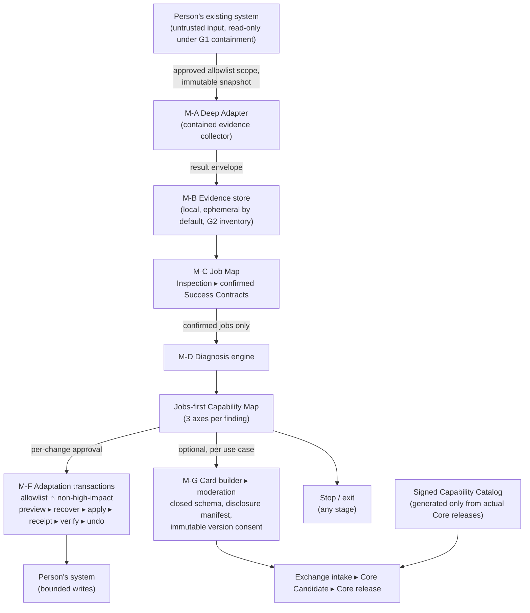
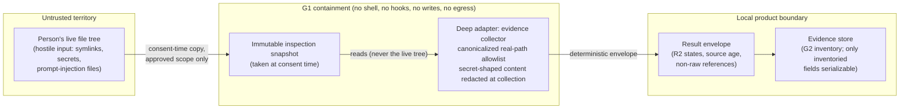

# Architecture: data flow and trust boundaries

Initial reviewable artifact per R7 ("data-flow and trust-boundary diagrams"). Source:
HANDOFF.md Section 2.4; keep this document current as milestones land. The prose
walkthrough below covers the M1 slice (adapter → evidence store boundary), which is the
only part with code under construction; later milestones extend the diagram's lower half.

## Trust-boundary diagram (full product, from HANDOFF Section 2.4)

All of this is fronted by the M-E concierge over loopback with R3 session security
(single-use machine-bound token, CSRF/Origin checking, scope revalidation before every
read batch, verifiable cancellation).

Load-bearing boundaries between modules:

- The **diagnosis side never holds a write capability** (non-negotiable boundary 1).
- The **adaptation side never reads beyond its approved target**.
- The **contribution side sees only what serialization rules permit** (G2 typed boundary).

### M5 hosted contribution boundary (unreleased candidate)

The optional stage-nine connection is deliberately not a general network
client. It begins only when the person chooses to contribute. Reusable
candidate patterns are projected locally from the existing candidate-job id
and inferred evidence state; proposal prose and evidence references never
enter the candidate projection.

Before a Card can be built, a deterministic local gate checks explicit health,
family/care, finance, personnel and named-company language plus the existing
secret, identifying-data, unique-path and raw-source rules. A match is not
"redacted" substring by substring: every prose-bearing field is replaced by a
generic structured Card. The screen shows fixed **retained** and **removed**
classes and the exact resulting Card, without echoing the matched words. A
personal-looking candidate advances only when the person submits the exact
sentence shown on that screen. Edits repeat the same gate. Decline stores only
a domain-separated candidate SHA-256 in app storage outside inspected roots;
a fresh process reads it and does not offer that candidate again. The ledger
has a registered verified deletion path.

This classifier is deliberately conservative and local, not a claim that free
text can be reliably anonymized. Raw prose/files and extra Card fields remain
structurally unrepresentable, and the disclosure boundary rechecks the final
Card. Identity is first requested after the exact disclosure bytes and six
permissions are approved; the intake network port is first called by the later
submit action.

After the person edits and approves one canonical DisclosureManifest,
the client writes a minimal `submitting` receipt outside every inspected root,
then posts the manifest's exact UTF-8 bytes as the sole body to the pinned
`https://api.heydex.ai/api/capability-contributions/submit` route. A closed,
inventoried `X-Dex-*` header set carries only the manifest and consent hashes,
one-way receipt binding, idempotency key and six strict permission booleans.
The linked Heydex session token supplies identity at this boundary only. The
private revocation token, inspected files, raw evidence and full Card never
travel.

The service recalculates the body hash, validates canonical JSON and allowed
fields, resolves the authenticated contributor server-side, scans before human
moderation, and returns an exact bound receipt. Correction creates a new
version; withdrawal clears active disclosure bytes and permissions; deletion
removes contributor identity and receipt authority while retaining only the
documented abuse/audit tombstone. The local receipt is mode `0600`, has a
registered verified deletion path, and is removed after an exact affirmative
withdrawal. A receiptless Markdown POST is not an alternative contribution
path: the old `dex-lens share --to heydex` channel now refuses, while its GitHub
mode only prints a link that the person may submit themselves.

## M1 slice walkthrough: adapter → evidence store

M1 builds only the read-only top of the diagram: the Host Adapter contract, the contained
Claude Code deep adapter, and the evidence store boundary. No adaptation, no contribution,
no concierge yet.

Walkthrough, stage by stage:

1. **Consent-time snapshot.** At the moment the person approves an explicit inspection
   scope, the adapter takes an immutable snapshot of exactly the approved, canonicalized
   real-path allowlist. All subsequent reads are served from the snapshot, never the live
   tree — a mutation-during-inspection fixture proves this. Symlinks are resolved; any
   that escape the allowlist are rejected, as are the hard-link and bind-mount variants
   of the same escape.

   The bind-mount variant needed a check of its own. `mount --bind ~/.ssh
   <approved-root>/subdir` within one filesystem keeps the approved root's `st_dev`,
   gives the grafted directory an inode of its own, and is not a symlink — so the device
   comparison passes, `os.path.ismount` returns False (it reports only a device change
   or a filesystem root), and `realpath` does not unwind it. Detection therefore reads
   the kernel's own mount table (`/proc/self/mountinfo` on Linux) and refuses every path
   at or below any mount point found *inside* an approved root, regardless of device;
   the survey additionally compares each directory entry's `readdir` inode against its
   `stat` inode, which exposes a mount on any POSIX host with no `/proc` needed. A root
   that is *itself* a mount point is not refused — that is the path the person named at
   consent time. If the mount table cannot be read on Linux, no allowlist is built and
   no read happens (fail closed).

   Evidence, not assertion: `tests/fixtures/hostile/test_g1_bind_mount_escape.py` makes
   a real bind mount inside a user namespace (`unshare -Umr`) and asserts the escape
   reproduces the hole — same device, `ismount` False, `realpath` unchanged — *before*
   asserting it is refused. Where the host forbids user namespaces it skips with a
   visible reason and raises a warning rather than passing quietly: a containment
   property that cannot be proven on a host is not a property that host has.

2. **Contained collection.** The collector runs as an evidence collector, not an agent:
   no arbitrary shell, no hook installation, no file writes to the inspected system, no
   network egress from the inspection process — enforced at the OS capability level
   (sandbox/seccomp-style harness proves the process cannot open sockets or spawn shells
   even if its own code is buggy; macOS enforcement sits behind a Linux-testable
   abstraction). Inspected file content is **untrusted data**: no instruction inside an
   inspected file (CLAUDE.md, README, configs) may alter adapter behavior — verified by
   byte-identical behavior against a control run. Secret-shaped content is redacted at
   collection and never stored raw. Any external model request would require a separate
   explicit consent; none exists in M1.

3. **Result envelope crossing the boundary.** The only thing that crosses from the
   contained collector into the product is a deterministic result envelope. Every evidence
   item carries a state from the closed R2 vocabulary (`observed`, `user-reported`,
   `inferred`, `stale`, `conflicting`, `absent`, `not assessed`, `insufficient`,
   `blocked`, `unverified`, `withdrawn`), a source age, and a **non-raw reference** — a
   reference containing raw file content fails validation. Instrument failure is reported
   as failure, never counted as success. Missing or unknown state degrades to
   `not assessed` and supports nothing.

4. **Evidence store behind the G2 typed serialization boundary.** Only fields with an
   entry in the machine-readable data inventory are serializable; any field without an
   entry is private, non-persistable, non-transmittable — enforced by type, checked in CI.
   Default processing is ephemeral and telemetry-free. The default-path egress test plants
   canary secrets in the inspected system and asserts neither the canaries nor any
   derivation of them (hashes, embeddings) ever appear on the wire.

Fail-closed behavior on this slice: if containment cannot be proven for a host, the deep
adapter is disabled for that host entirely; at runtime, any path-resolution ambiguity,
snapshot failure, or detected escape aborts the inspection and discards partial
collection — never best-effort live reads.

### What each OS actually enforces for G1 no-egress

Both supported platforms reach the same guarantee, through different kernel mechanisms.
The difference is worth stating rather than hiding behind one word:

| | Linux | macOS |
| --- | --- | --- |
| Mechanism | seccomp BPF filter, installed by the child on itself | Seatbelt profile, applied by the parent via `sandbox-exec` |
| No-egress rule | the `socket` syscall family denied (EPERM) | `(deny network*)` for connect/bind, with `(deny system-socket)` kept as the narrowest known socket-creation rule |
| Proof label | `socket-denied` | `connect-denied` in practice; `socket-denied` is also accepted if a future host enforces the creation rule |
| Extra layer | network namespace unshared where the kernel permits | — |
| Interpreter exec set | not applicable | three enumerated `literal` paths, each canonicalised — Seatbelt resolves the exec target before matching, so an unresolved symlink can never match |

The deep adapter requires a runtime tuple proving no-write, no-exec, and no-network
before any target read. The no-network requirement is satisfied by **either** proof
label, because both prove the same property at the layer the OS actually enforces.
Requiring the Linux-shaped `socket-denied` label made the deep adapter permanently
unreachable on macOS, which is the only platform Lens currently supports, so on every
Mac the product silently degraded to the guided path that reads nothing. The label is
never rewritten: `ContainmentOutcome.proofs` carries whichever proof the host actually
produced, and the interface shows it verbatim.

`(deny network*)` alone would **not** be equivalent, and for a while it was all the
profile had. `network-outbound`, `network-inbound` and `network-bind` are each checked
after a socket already exists, so under them a buggy collector may still get a live fd.
Seatbelt has a separate operation named `system-socket` — Apple's own deny-default
profiles for ordinary TCP clients (for example `com.apple.security.XPCAcmeService.sb`)
have to allow it alongside `network-outbound` to get a socket at all. Denying it is
therefore still the narrowest known expression of the intended stronger guarantee.
However, CI on GitHub's macos-14 runners proved that this profile still permits Python
to create AF_INET and AF_INET6 sockets. The enforced macOS guarantee today is
"socket fd may exist, but outbound use is denied before egress"; the runtime proof and
macOS egress test assert exactly that, and fail if connect ever succeeds or reaches a
real listener.

Two residual asymmetries stay stated rather than glossed:

- Linux self-confines — the filter is installed by the process on itself and cannot be
  lifted — while macOS depends on the parent having launched the child under
  `sandbox-exec`. What closes that gap is the runtime proof: `prove_containment` runs
  before any target read and the child refuses to collect if its probes do not show the
  denial, so a child launched without the profile reads nothing.
- macOS enforcement is exercised only on the darwin CI matrix leg; there is no darwin
  host in local development, so a macOS containment regression is caught by CI or not at
  all.
